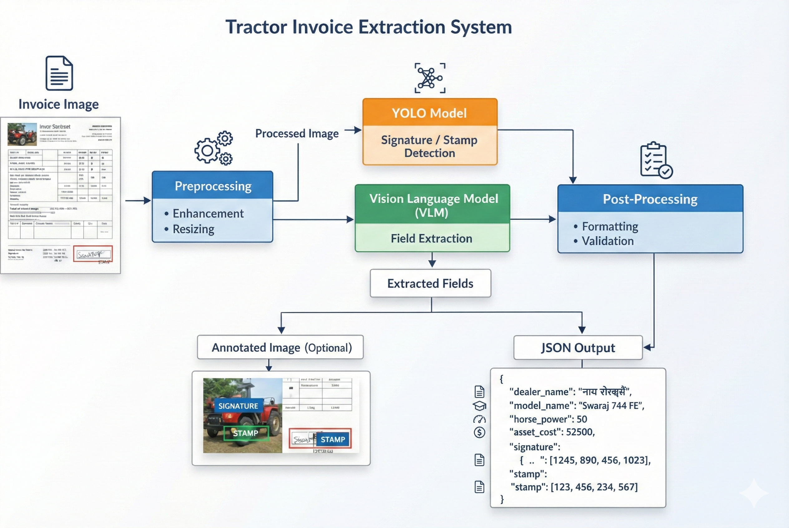
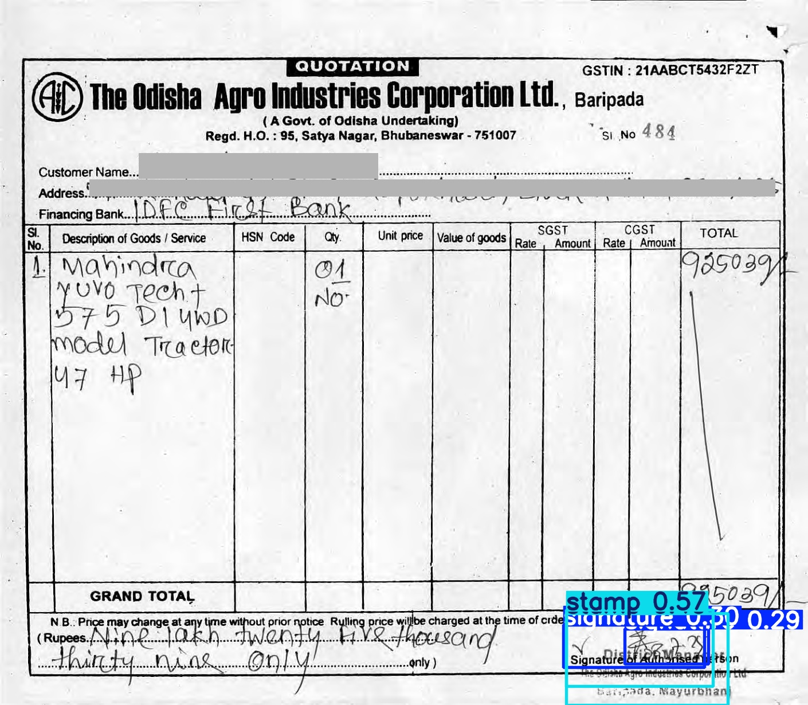

# 🚜 Tractor Invoice Extraction System

**Intelligent Document Processing using YOLO and Qwen-7B Vision-Language Model**

An end-to-end AI system for extracting structured information from tractor invoice images by combining **object detection** and **vision-language reasoning**. Designed for real-world invoices containing mixed layouts, stamps, signatures, and vernacular text.

---

## 📌 Overview

The **Tractor Invoice Extraction System** is a production-oriented Intelligent Document Processing (IDP) pipeline that converts raw invoice images into structured, machine-readable JSON.

The system integrates:

- **YOLO** for precise visual detection (signatures & stamps)
- **Qwen-3B Vision-Language Model** for semantic field extraction
- **Device-aware execution** for seamless deployment on GPU, Apple Silicon, or CPU

This makes the system suitable for automation workflows such as audits, asset verification, and financial processing.

---

## 🧠 Key Highlights

- ✅ Vision + Language fusion (not OCR-only)
- ✅ Robust to real-world invoice layouts
- ✅ Supports Indian vernacular scripts (Hindi, Gujarati, etc.)
- ✅ One-command execution for reviewers
- ✅ Modular, extensible, and reproducible design

---

## 🏗️ System Architecture

### High-Level Pipeline

**Architecture Diagram**



---

## 🧪 YOLO Detection Output & Extracted JSON

The following example shows the **YOLO detection output** (signature & stamp bounding boxes) alongside the **structured JSON extracted** from the invoice.

<table>
<tr>
<td width="50%" align="center" valign="top">

### 🖼️ YOLO Detection Output



</td>
<td width="50%" valign="top">

### 📄 Extracted JSON

```json
{
    "doc_id": "172946013_2_pg23",
    "fields": {
        "dealer_name": "The Odisha Agro Industries Corporation Ltd.",
        "model_name": "Mahindra Yuvo Tech+ 575 DI 4WD",
        "horse_power": 97,
        "asset_cost": 925039,
        "signature": {
            "present": false,
            "bbox": []
        },
        "stamp": {
            "present": true,
            "bbox": [
                988,
                1070,
                1270,
                1230
            ]
        }
    },
    "confidence": 0.91,
    "processing_time_sec": 79.16,
    "cost_estimate_usd": 0
}
```

</td>
</tr>
</table>

---

## 🎯 Features

- **Multi-Field Information Extraction**
  - Dealer / Agency name
  - Tractor model name
  - Horsepower (HP)
  - Asset cost

- **Signature & Stamp Detection**
  - YOLO-based object detection
  - Bounding box localization

- **Cross-Platform Device Optimization**
  - NVIDIA CUDA GPUs
  - Apple Silicon (M1 / M2 / M3 via MPS)
  - CPU fallback

- **Clean JSON Output**
  - Printed to terminal
  - Saved locally for downstream usage

- **Optional Visual Validation**
  - Annotated images with detections

---

## 📋 System Requirements

### Hardware Requirements

| Component | Requirement |
|-----------|-------------|
| RAM       | Minimum 8GB (16GB+ recommended) |
| GPU       | Optional (CUDA or Apple Silicon supported) |
| Storage   | ~20GB free (models + cache) |

### Software Requirements

- Python **3.8+**
- PyTorch **2.0+**
- CUDA Toolkit (optional, for NVIDIA GPUs)
- macOS 13+ (for Apple Silicon MPS support)

---

## 📦 Dependencies

All Python dependencies are listed in `requirements.txt`.

> ⚠️ **Note**: The Qwen-3B Vision-Language Model download size is approximately **7GB** and will be downloaded automatically on first run.

---

## 🤖 Models Used (Detailed Explanation)

### 1️⃣ YOLO (You Only Look Once)

**Purpose**: Visual detection of **signatures and stamps**

- Fine-tuned YOLO model (`best.pt`)
- Trained on manually annotated dataset consisting of ~200 images
- Detects:
  - Handwritten signatures
  - Official stamps
- Outputs:
  - Presence flag
  - Bounding box coordinates `[x1, y1, x2, y2]`

**Why YOLO?**

- Fast inference
- High localization accuracy
- Robust to cluttered documents

---

### 2️⃣ Qwen-3B Vision-Language Model (VLM)

**Purpose**: Semantic understanding and field extraction

- Model: **Qwen-3B Vision-Language**
- Capable of:
  - Reading structured + unstructured invoice layouts
  - Understanding context beyond OCR
  - Preserving original language/script

**Extracted Fields**

- Dealer name
- Model name
- Horsepower
- Asset cost

**Why Qwen-3B?**

- Strong multimodal reasoning with minimal resource requirements and fast inference
- Excellent performance on document understanding
- Open-source and reproducible

---

## ⚙️ Installation, Setup & Usage Guidelines

### 1️⃣ Environment Setup (Recommended)

Create and activate a virtual environment:

**macOS / Linux:**

```bash
python3 -m venv venv
source venv/bin/activate
```

**Windows:**

```bash
python -m venv venv
venv\Scripts\activate
```

Install dependencies:

```bash
pip install -r requirements.txt
```

### 2️⃣ Project Structure

> ⚠️ **Note**: The user needs to create the folder inside the `submission/` folder for storing the images to be processed and copy the relative path to provide after running `main.py`.

```
invoice-extraction/
│
├── executable.py              # Main execution script
├── requirements.txt           # Dependencies
├── README.md
│
├── input_images/              # User-provided invoice images
│
├── utils/
│   ├── best.pt                # YOLO model weights
│   ├── extractor.py           # Core extraction pipeline
│   ├── preprocessing.py       # Image preprocessing
│   ├── finetuning.py          # YOLO training reference
│   └── utilities.py
│
├── sample_output/             # Sample outputs (optional)
│
└── output/                    # Auto-generated outputs
    ├── invoice_001.json
    └── annotated/
        └── invoice_001_annotated.jpg
```

### 3️⃣ Running the System

```bash
python executable.py path/to/invoice.jpg
```

The output directory will be created inside the `submission/` folder where the output JSON will be stored.
